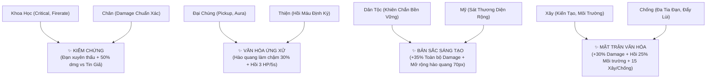

# HỆ THỐNG CHỈ SỐ, BUFF & KỸ NĂNG — VĂN HÓA 404

Tài liệu chi tiết toàn bộ các cơ chế chỉ số nhân vật, hệ thống 8 trụ cột nâng cấp, 4 kỹ năng tiến hóa, hiệu ứng tình huống thực tế và cơ chế Môi Trường Văn Hóa trong game **Văn Hóa 404**.

---

## 1. BẢNG CHỈ SỐ NHÂN VẬT (PlayerStats)

| Chỉ số | Khởi điểm | Cơ chế hoạt động trong trận đấu | Cách gia tăng |
| :--- | :---: | :--- | :--- |
| **`hp`** | 100 | Máu hiện tại của nhân vật. Khi nhận sát thương từ quái hoặc sự kiện, HP sẽ bị trừ. Nếu HP tụt về `<= 0`, người chơi tử trận. | Hồi máu qua trụ cột Thiện (+2 HP/5s), Tiến hóa Văn Hóa Ứng Xử, hoặc lựa chọn đúng sự kiện. |
| **`maxHp`** | 100 | Máu tối đa của nhân vật. Mọi hiệu ứng hồi máu đều bị giới hạn bởi trần `maxHp`. | Có thể gia tăng thông qua các hiệu ứng đặc biệt. |
| **`moveSpeed`** | 240 | Tốc độ di chuyển tính theo pixel/giây (hỗ trợ phím WASD, mũi tên, hoặc kéo ngón tay trên màn cảm ứng). | Nâng cấp thẻ Xây (+12/cấp, tối đa cấp 5), buff Môi Trường Trong Lành (+8%). |
| **`damage`** | 15 | Sát thương cơ bản của mỗi phát đạn bắn ra. | Nâng cấp thẻ Chân (+2.5/cấp), thẻ Chống (+2/cấp), thẻ Mỹ (+1.8/cấp), Tiến Hóa, và buff tạm thời. |
| **`attackSpeed`** | 1.2 | Tốc độ bắn (số phát bắn mỗi giây). Thời gian giãn cách giữa 2 loạt bắn: `cooldown = 1000 / attackSpeed` ms. | Nâng cấp thẻ Khoa Học (+0.1/cấp, tối đa cấp 5), sự kiện tích cực. |
| **`projectileCount`**| 1 | Số lượng tia đạn phát ra trong mỗi đòn tấn công. Đạn tỏa đều hình nón `0.15 rad`. | Nâng cấp thẻ Chống (+1 tia tại các mốc Cấp 1, Cấp 3, Cấp 5; tối đa 4 tia). |
| **`projectileSpeed`**| 450 | Vận tốc bay của viên đạn (pixel/giây). Giúp đạn bay nhanh đến mục tiêu di động. | Chỉ số cơ bản của vũ khí. |
| **`pickupRadius`** | 90 | Bán kính hút ngọc kinh nghiệm XP (Magnet Radius). Ngọc trong phạm vi này sẽ tự động lướt mượt mà về phía người chơi. | Nâng cấp thẻ Đại Chúng (+22px/cấp, tối đa cấp 5). |
| **`critChance`** | 5% (0.05) | Tỉ lệ đòn đánh gây sát thương chí mạng (**x2.0 sát thương**, hiển thị số damage màu vàng cam nổi bật). | Nâng cấp thẻ Khoa Học (+4%/cấp, tối đa 25%). |
| **`shield`** | 0 | Điểm khiên bảo vệ. Hấp thụ toàn bộ sát thương thay cho HP cho đến khi cạn kiệt. | Nâng cấp thẻ Dân Tộc (+15 khiên/cấp, tối đa +75 khiên), các quyết định sự kiện. |
| **`buildPower`** | 0 | **Sức mạnh Kiến Tạo (Xây)**: Tăng tốc độ thanh lọc Môi Trường (+0.02%/điểm), tăng hiệu lực hồi máu định kỳ (+2%/điểm), và tăng sát thương Hào Quang (+0.4 dmg/điểm). | Thẻ Xây (+4/cấp), thẻ Đại Chúng (+3/cấp), Tiến Hóa Mặt Trận Văn Hóa (+15). |
| **`fightPower`** | 0 | **Sức mạnh Đấu Tranh (Chống)**: Tăng trực tiếp toàn bộ sát thương vũ khí (+1.0%/điểm) lên quái và Boss, đồng thời gia tăng lực đẩy lùi (+2px/điểm) khi bắn trúng quái. | Thẻ Chống (+5 đến +10/cấp), Tiến Hóa Mặt Trận Văn Hóa (+15). |

---

## 2. HỆ THỐNG 8 TRỤ CỘT & GIỚI HẠN CẤP ĐỘ (Stat Level Cap: Max 5)

Mỗi chỉ số trụ cột có **giới hạn tối đa là Cấp 5 (Level Cap: 5/5)**. Khi một trụ cột đạt Cấp 5, các thẻ bài của trụ cột đó sẽ không còn xuất hiện trong danh sách lựa chọn thăng cấp, khuyến khích người chơi xây dựng bộ chỉ số cân bằng, đa dạng thay vì dồn toàn lực vào một chỉ số duy nhất.

Nếu người chơi tối đa hóa toàn bộ 8 trụ cột (tổng 40 cấp), thẻ bài đặc biệt **Đại Viên Mãn Giá Trị (Hồi Phục)** sẽ được kích hoạt để hồi phục sinh lực và khiên chắn.

### 1. Tư Duy Phản Biện (Khoa Học: 1 → 5)
* **Trụ cột**: `khoaHoc` (+1 cấp, tối đa 5)
* **Hiệu ứng mỗi cấp**: `+8% Tốc độ bắn`, `+4% Tỉ lệ bạo kích` (Cấp 5: +40% tốc bắn, +20% bạo kích)
* **Ý nghĩa**: Rèn luyện khả năng kiểm chứng logic, tăng nhịp xả đạn và xác suất chí mạng x2.

### 2. Bản Sắc Bền Vững (Dân Tộc: 1 → 5)
* **Trụ cột**: `danToc` (+1 cấp, tối đa 5)
* **Hiệu ứng mỗi cấp**: `+15 Khiên chắn bảo vệ`, `+10 Máu tối đa (HP)` (Cấp 5: +75 khiên, +50 HP)
* **Ý nghĩa**: Củng cố sức chống chịu bền vững, bảo vệ người chơi trước các đợt công kích dồn dập.

### 3. Lan Tỏa Cộng Đồng (Đại Chúng: 1 → 5)
* **Trụ cột**: `daiChung` (+1 cấp, tối đa 5)
* **Hiệu ứng mỗi cấp**: `+22 Bán kính nhặt XP`, `+3 Sức mạnh Xây`, mở rộng Hào quang Văn hóa
* **Ý nghĩa**: Kết nối cộng đồng, thu hút ngọc kinh nghiệm từ xa và gia tăng năng lực bảo vệ môi trường.

### 4. Xác Thực Chân Lý (Chân: 1 → 5)
* **Trụ cột**: `chan` (+1 cấp, tối đa 5)
* **Hiệu ứng mỗi cấp**: `+15% Sát thương đạn chuẩn xác` (+2.5 sát thương cơ bản mỗi cấp)
* **Ý nghĩa**: Nâng tầm sát thương thực chất, không bị phụ thuộc vào may rủi.

### 5. Ứng Xử Văn Minh (Thiện: 1 → 5)
* **Trụ cột**: `thien` (+1 cấp, tối đa 5)
* **Hiệu ứng mỗi cấp**: `Hồi phục +1 HP mỗi 4 giây` (Cấp 5: hồi 5 HP mỗi 4s, tăng theo Sức mạnh Xây)
* **Ý nghĩa**: Duy trì sức bền sinh lực trường kỳ trong các trận chiến kéo dài.

### 6. Thẩm Mỹ Số (Mỹ: 1 → 5)
* **Trụ cột**: `my` (+1 cấp, tối đa 5)
* **Hiệu ứng mỗi cấp**: `+10% Sát thương diện rộng` (+1.8 sát thương) và mở rộng +12% bán kính Hào quang
* **Ý nghĩa**: Mở rộng tầm bảo vệ và sát thương diện rộng thanh tẩy khu vực xung quanh.

### 7. Tường Lửa Chống Lệch Chuẩn (Chống: 1 → 5)
* **Trụ cột**: `fight` (+1 cấp, tối đa 5)
* **Phân phối cấp độ chuẩn xác**:
  * **Cấp 1**: `+1 Tia đạn (Tổng 2 tia)`, `+2 Sát thương`, `+5 Sức mạnh Chống`
  * **Cấp 2**: `+2 Sát thương chuẩn`, `+6 Sức mạnh Chống`
  * **Cấp 3**: `+1 Tia đạn (Tổng 3 tia)`, `+2 Sát thương`, `+7 Sức mạnh Chống`
  * **Cấp 4**: `+2 Sát thương chuẩn`, `+8 Sức mạnh Chống`
  * **Cấp 5 (Tối Đa)**: `+1 Tia đạn tối thượng (Tổng 4 tia)`, `+2 Sát thương`, `+9 Sức mạnh Chống`
* **Ý nghĩa**: Khống chế số lượng tia đạn ở mức tối đa 4 tia, ngăn chặn việc xả đạn vô tận làm mất cân bằng trận đấu.

### 8. Kiến Tạo Giá Trị Tích Cực (Xây: 1 → 5)
* **Trụ cột**: `build` (+1 cấp, tối đa 5)
* **Hiệu ứng mỗi cấp**: `+12 Tốc độ di chuyển`, `Hồi phục ngay +10% Môi Trường Số`, `+4 Sức mạnh Xây`
* **Ý nghĩa**: Tăng tốc độ cơ động né đòn và kích hoạt khả năng thanh lọc môi trường liên tục.

---

## 3. TIẾN HÓA KỸ NĂNG KẾT HỢP (Cultural Evolutions)

Khi người chơi sở hữu cùng lúc các cặp giá trị tương hỗ (>= cấp 1), kỹ năng tối thượng sẽ tự động được khai mở:

### 1. Kiểm Chứng (Khoa học + Chân)
* **Mô tả**: *"Đạn xuyên thấu mọi mục tiêu và gây thêm 50% sát thương lên Tin Giả."*
* **Cơ chế**: Đạn không còn biến mất khi chạm quái vật đầu tiên mà bay thẳng xuyên suốt đội hình địch; quái vật `tinGia` nhận sát thương nhân thêm hệ số `1.5x`.

### 2. Văn Hóa Ứng Xử (Đại chúng + Thiện)
* **Mô tả**: *"Hào quang xung quanh làm chậm quái 30% và hồi máu đều đặn (+3 HP mỗi 5s)."*
* **Cơ chế**: Tăng thêm `30%` hiệu quả làm chậm trong vùng hào quang (quái bị giảm mạnh tốc độ tiếp cận) và bổ sung thêm `+3 HP` mỗi chu kỳ hồi phục 5 giây.

### 3. Bản Sắc Sáng Tạo (Dân tộc + Mỹ)
* **Mô tả**: *"Đòn tấn công sóng năng lượng lan tỏa diện rộng, tăng 35% sát thương và mở rộng hào quang."*
* **Cơ chế**: Nhân trực tiếp `1.35x` sát thương toàn bộ vũ khí và mở rộng thêm `70px` bán kính vùng ảnh hưởng của hào quang văn hóa.

### 4. Mặt Trận Văn Hóa (Xây + Chống cân bằng)
* **Mô tả**: *"Xây và Chống đi đôi: +30% Sát thương, hồi ngay 25% Môi Trường Văn Hóa, +15 Xây & Chống."*
* **Cơ chế**: Đạt đỉnh cao nhận thức "Xây đi đôi với Chống", tăng ngay `1.30x` sát thương, lập tức khôi phục `+25%` Môi Trường Văn Hóa, đồng thời tăng vọt 15 điểm chỉ số Xây và 15 điểm chỉ số Chống.

---

## 4. TÌNH HUỐNG THỰC TẾ & BUFF TẠM THỜI 30 GIÂY (Random Scenario Events)

Các tình huống xuất hiện ngắt nhịp trận đấu, yêu cầu người chơi giải quyết bài toán văn hóa mạng với hệ quả trực tiếp:

### 🎲 Cơ Chế Ngẫu Nhiên Hóa Câu Hỏi & Lựa Chọn:
* **Xuất hiện ngẫu nhiên**: Các câu hỏi tình huống được chọn ngẫu nhiên từ kho dữ liệu phong phú (Tin đồn chưa kiểm chứng, Công kích hội đồng, Xuyên tạc văn hóa, Đạo nhái sáng tạo, Video giả mạo Deepfake AI, Thuật toán kích động thù ghét Rage-bait, Tin đồn y tế trôi nổi,...).
* **Xáo trộn đáp án**: Thứ tự các lựa chọn trong mỗi câu hỏi được xáo trộn ngẫu nhiên để tránh việc người chơi đoán trước phím bấm.
* **Thời điểm xuất hiện**: Phân bố ngẫu nhiên dọc theo trận đấu 10 phút, tự động tránh các mốc xuất hiện Trùm (phút thứ 3, 5, 7, 10).

| Tình huống tiêu biểu | Lựa chọn ứng xử văn hóa | Hiệu ứng nhận được (Buff kéo dài 30 giây) |
| :--- | :--- | :--- |
| **Tin Đồn Chưa Kiểm Chứng** | **Kiểm chứng nguồn tin** | `+15 Khiên`, `+25% Sát thương (30s)`, `+15% Môi Trường`, `+20% XP (30s)` |
| | Chia sẻ cảnh báo ngay | `-5 HP`, `-15% Môi Trường`, sinh 6 quái Tin Giả tăng 20% tốc độ |
| | Báo cáo vi phạm | `+10 Khiên`, `+15% Môi Trường`, làm chậm quái 20% (30s) |
| **Công Kích Hội Đồng (Cyberbullying)** | **Lên tiếng bênh vực văn minh** | `+20 Khiên`, `+15% Sát thương` & `+15% Tốc bắn (30s)`, `+20% Môi Trường`, làm chậm quái 15% (30s) |
| | Hùa theo bình luận ác ý | `-10 HP`, `-20% Môi Trường`, sinh 4 quái Bạo Lực Ngôn Từ tăng 25% tốc độ |
| **Xuyên Tạc Di Sản Văn Hóa** | **Đính chính tư liệu chuẩn xác** | `+25 Khiên`, `+25% Sát thương` & `+10% Tốc bắn (30s)`, `+25% Môi Trường`, `+20% XP (30s)` |
| | Thả phẫn nộ câu view | `-5 HP`, `-15% Môi Trường`, sinh 2 quái Tinh Anh Xuyên Tạc tăng 10% tốc độ |
| **Đạo Nhái Tác Phẩm Sáng Tạo** | **Bảo vệ quyền tác giả gốc** | `+25 Khiên`, `+30% Sát thương` & `+15% Tốc bắn (30s)`, `+25% Môi Trường`, làm chậm quái 15% (30s) |
| | Thờ ơ xem như bình thường | `-10% Sát thương (15s)`, `-10% Môi Trường`, sinh 5 quái Clickbait tăng 10% tốc độ |
| **Video Deepfake AI Lừa Đảo** | **Soi xét khẩu hình & Báo cáo AI** | `+25 Khiên`, `+25% Sát thương` & `+10% Tốc bắn (30s)`, `+20% Môi Trường`, `+20% XP (30s)` |
| | Tin tưởng chuyển tiền ngay | `-10 HP`, `-20% Môi Trường`, sinh 5 quái Tin Giả tăng 20% tốc độ |
| **Thuật Toán Kích Động Thù Ghét** | **Chọn "Không quan tâm" & Gắn kết** | `+20 Khiên`, `+20% Sát thương` & `+15% Tốc chạy (30s)`, `+25% Môi Trường`, làm chậm quái 15% (30s) |
| | Lao vào cãi vã xả giận | `-5 HP`, `-15% Môi Trường`, sinh 2 quái Cực Đoan Mạng tăng 20% tốc độ |
| **Tin Đồn Y Tế Trôi Nổi** | **Đối chiếu tài liệu y khoa chính thống** | `Hồi +20 HP`, `+20 Khiên`, `+20% Sát thương` & `+15% Tốc bắn (30s)`, `+20% Môi Trường`, `+20% XP (30s)` |
| | Chia sẻ bài thuốc truyền miệng | `-10 HP`, `-10% Sát thương (15s)`, `-20% Môi Trường`, sinh 4 quái Tâm Lý Đám Đông |

### ✨ Visual Cues & Cơ Chế Giới Hạn Thời Gian 30 Giây:
1. **Visual Cue trên nhân vật**: Khi nhận buff, xung quanh người chơi xuất hiện **Vòng Hào Quang Ánh Kim & Hạt Năng Lượng Xanh Ngọc (Cyan Aura Ring)** chuyển động xoay tròn và nhấp nháy phát sáng (`Player.buffAuraGfx`), đồng thời nhân vật phát quang ánh xanh cyber.
2. **Visual Cue trên thanh HUD**: Thanh Banner trên cùng hiển thị chi tiết các chỉ số buff cùng **đồng hồ đếm ngược trực tiếp `[Xs]`** (ví dụ: `✨ +25% Sát thương • +10% Tốc bắn [29s]`).
3. **Hoàn trả chỉ số tự động**: Hết đúng 30 giây, vòng hào quang tự biến mất, chỉ số được hoàn trả chuẩn xác và thanh HUD tự động ẩn đi.

---

## 4.1. CÁC TÍNH NĂNG VÀ CẢI TIẾN TRẢI NGHIỆM ĐẶC BIỆT

### 🎧 Bộ Lọc Âm Thanh Đạn Xuyên Thấu (Audio Hit Throttle):
* Khắc phục hiện tượng khi đạn xuyên thấu bắn qua cụm quái đông hàng chục con làm hàng chục âm thanh va chạm chồng lên nhau gây chói tai và méo tiếng.
* Tích hợp bộ **Audio Rate Limiter (giãn cách tối thiểu 75ms)** kết hợp điều chỉnh gain êm ái, mang lại trải nghiệm âm thanh gõ đòn giòn tan, thỏa mãn và dễ chịu.

### ❓ Nút Trợ Giúp Đa Năng [Phím H] (Interactive Tactical Guide):
* Nút `❓ Trợ giúp [H]` trên thanh HUD được thiết kế tương tác trực tiếp với hiệu ứng đổi màu hover và con trỏ chuột bàn tay.
* Nhấn phím `H` hoặc click chuột để tạm dừng trận đấu và tra cứu nhanh bảng cẩm nang 3 tab:
  * **Tab 1**: Điều khiển & Cơ chế cơ bản.
  * **Tab 2**: Hệ thống 8 Trụ Cột Giá Trị & 4 Công thức Tiến Hóa.
  * **Tab 3**: Cột mốc Trùm (3m, 5m, 7m, 10m) & Mẹo vượt ải.

### ☠️ Bảng Tử Trận Ghi Rõ Thủ Phạm (Death Screen Attribution):
* Khi người chơi bị hạ gục, màn hình Tổng Kết sẽ hiển thị một biểu ngữ màu đỏ nổi bật:  
  `☠️ NGUYÊN NHÂN TỬ TRẬN: Bị hạ gục bởi [ TÊN KẺ ĐỊCH / TRÙM / BÃO ĐẠN ]`.
* Giúp người chơi nắm bắt nguyên nhân tử trận (do đạn tầm xa, do va chạm quái lướt, do vùng độc tố, hay do hậu quả từ quyết định sự kiện sai lầm).

---

## 5. CƠ CHẾ CÂN BẰNG MÔI TRƯỜNG VĂN HÓA SỐ (Dynamic Community Meter)

Nhằm khắc phục tình trạng chỉ số Môi Trường bị "khóa cứng ở 100%" và trở nên vô nghĩa khi người chơi đã mạnh, hệ thống Môi Trường được đại tu thành một **hệ sinh thái động lực học hai chiều**:

* **Thang điểm**: `0% — 100%` (Khởi điểm: `75%`).
* **Áp lực ô nhiễm số liên tục (Continuous Digital Pollution)**:
  * Mỗi quái vật tiêu cực đang tồn tại trên bản đồ liên tục phát tán "rác thông tin": `Ô nhiễm = -0.035% x số quái / giây`. (Ví dụ: 15 quái = -0.525%/s; 25 quái = -0.875%/s).
  * Khi có Đại Trùm đang hoành hành trên chiến trường: Áp lực khủng hoảng cộng thêm `-0.45%/giây`.
  * **Tổn hại khi bị công kích (Damage Contamination)**: Mỗi khi người chơi bị quái vật đánh trúng làm mất HP, độc tố số ngấm vào cộng đồng, thanh Môi Trường bị trừ trực tiếp `-0.12 x sát thương gánh chịu`.
* **Cơ chế phục hồi & Thanh lọc (Purification & Restoration)**:
  * **Năng lượng Xây (Build Power)**: Mỗi điểm đầu tư vào trụ cột Xây và chỉ số Sức mạnh Xây tạo ra trường thanh lọc tự động liên tục: `Phục hồi = (values.build * 0.12 + buildPower * 0.02) / giây`. Người chơi càng đầu tư vào Xây, tốc độ tự làm sạch không gian mạng càng mạnh mẽ.
  * Tiêu diệt Quái Tinh Anh (Elite): Lập tức hồi `+3.5%` Môi Trường.
  * Tiêu diệt Đại Trùm: Lập tức thanh tẩy toàn bộ chiến trường `+20%` Môi Trường.
* **4 Trạng thái Môi Trường & Cơ chế Thưởng / Phạt**:
  1. **Trong Lành (`> 70%`)** *(Thanh xanh ngọc `#10b981`)*: Không gian mạng văn minh, lành mạnh. Người chơi nhận **Buff Khuyến Khích: `+8% Tốc độ di chuyển`**.
  2. **Bình Thường (`30% — 70%`)** *(Thanh lam cyber `#0891b2`)*: Mức ổn định cơ bản.
  3. **Ô Nhiễm (`< 30%`)** *(Thanh cam cảnh báo `#f59e0b`)*: Báo động không gian mạng bắt đầu suy thoái, quái vật xuất hiện dồn dập hơn.
  4. **Khủng Hoảng Toàn Diện (`<= 0%`)** *(Thanh đỏ rực `#dc2626`)*: Người chơi chịu **Debuff Nghiêm Trọng**:
     * **`-25% Sát thương`**
     * **`-20% Tốc độ di chuyển`**
     * Debuff chỉ được hóa giải khi khôi phục thanh Môi Trường vượt mốc `25%`.

---

## 6. CÔNG THỨC EXP NGHỊCH ĐẢO HÀM MŨ (Inverse Exponential XP Scaling)

Nhằm khắc phục nhược điểm của công thức tuyến tính (gây buồn ngủ lúc đầu hoặc quá chậm lúc sau) và công thức hàm mũ đơn thuần (tạo ra bức tường cản trở vô lý ở giai đoạn giữa và cuối), game áp dụng **Công thức Nghịch Đảo Hàm Mũ (Inverse Exponential)** kết hợp gia số bù trừ ổn định:

$$\text{nextLevelXP}(L) = \left\lfloor 10 + 70 \cdot \left(1 - e^{-0.085 \cdot (L - 1)}\right) + 3 \cdot (L - 1) \right\rfloor$$

### Ưu điểm thiết kế:
1. **Khởi đầu nhanh và trực quan (Levels 1 — 3)**: Người chơi chỉ cần nhặt `10 — 18 XP` để đạt ngay những cấp độ đầu tiên, nhanh chóng hình thành bộ kỹ năng cốt lõi.
2. **Tăng độ thử thách mượt mà (Levels 4 — 10)**: Số XP yêu cầu tăng dần đều đặn (`26 — 64 XP`) tương ứng với mật độ quái vật bắt đầu đông hơn trên bản đồ.
3. **Không tạo "bức tường kinh nghiệm" (Levels 15+)**: Nhờ độ cong tiệm cận của hàm nghịch đảo hàm mũ, mức XP yêu cầu không bị bùng nổ vô tận mà duy trì tốc độ thăng cấp ổn định (`75 — 95 XP`), giúp người chơi liên tục có cơ hội nâng cấp và thử nghiệm chiến thuật.

---

## 7. HỆ THỐNG 4 TRÙM, THANH MÁU TRÙM TRÊN ĐỈNH & CƠ CHẾ CHỐNG STACK ĐẠN

Trận đấu được cấu trúc thành 4 mốc thử thách trùm then chốt tại các phút **3, 5, 7 và 10**.

### 👑 Thanh Máu Trùm Cố Định Trên Đỉnh Màn Hình (Top Boss Health Bar):
* Khi Trùm xuất hiện, một thanh máu hoành tráng dài 620px cố định trên đỉnh màn hình (ngay dưới thanh HUD) sẽ hiện ra:
  * **Huy hiệu & Tên Trùm**: `👑 [CẤP I - 3 PHÚT] CƠN BÃO TÂM LÝ ĐÁM ĐÔNG`
  * **Thanh máu trực tiếp**: Dải màu đỏ sẫm `#dc2626` co giãn mượt mà theo sát thương gánh chịu.
  * **Chỉ số chi tiết**: Hiển thị chính xác `[HP Hiện Tại / HP Tối Đa (Phần Trăm %)]`.
  * **Biến mất mượt mà**: Khi Trùm bị hạ gục, thanh máu tự động mờ dần và giải phóng tầm nhìn.

### 🛡️ Khắc Phục Lỗi Xuyên Thấu Gây Sát Thương Đa Tầng (Anti-Frame Stacking):
* Trước đây, đạn xuyên thấu khi bay qua thân trùm khổng lồ (bán kính 40px) kích hoạt va chạm trên từng khung hình (60 frame/s), gây ra hàng chục lần sát thương trong chớp mắt khiến trùm bị "one-shot".
* **Giải pháp**: Mỗi viên đạn tích hợp cơ chế `hitTargetIds: Set<string>`. Một viên đạn chỉ có thể gây sát thương lên thân trùm hoặc cùng 1 quái vật **duy nhất 1 lần trong suốt đường bay**, giữ vững tính thử thách và yêu cầu người chơi phải né đòn, câu kéo và phối hợp kỹ năng thực thụ.

### 📌 Thứ Tự Trùm Cố Định (Fixed Boss Order):
Thứ tự 4 chủng loại trùm là **cố định** mỗi ván, theo thứ tự khai báo trong `DEFAULT_MVP_BOSSES` (`src/data/loader.ts`):

| Mốc | Trùm |
| :--- | :--- |
| 3 phút | Cơn Bão Tâm Lý Đám Đông (`boss_swarm`) |
| 5 phút | Lưới Độc Bạo Lực Mạng & Miệt Thị (`boss_dot`) |
| 7 phút | Ảo Ảnh Xuyên Tạc & Đạo Nhái (`boss_shield_dash`) |
| 10 phút | Hiện Thân Lệch Chuẩn Văn Hóa Số (`boss_final`) |

Thứ tự cố định giúp trùm cuối nhiều pha luôn xuất hiện ở phút 10, khớp với thẻ "Dấu mốc lịch sử" thứ ba ("trùm cuối đang chờ").

### ⚖️ Quy Tắc Phân Cấp Chỉ Số Bắt Buộc (Strict Stat Scaling):
Chỉ số Máu (HP) và Sát thương (Damage) của trùm **bắt buộc tuân thủ nguyên tắc tăng dần nghiêm ngặt theo thời gian**:
$$\text{Chỉ số (10 phút)} > \text{Chỉ số (7 phút)} > \text{Chỉ số (5 phút)} > \text{Chỉ số (3 phút)}$$

| Thông số | Mốc 3 Phút (Cấp I) | Mốc 5 Phút (Cấp II) | Mốc 7 Phút (Cấp III) | Mốc 10 Phút (Đại Trùm Tối Hậu) |
| :--- | :---: | :---: | :---: | :---: |
| **Máu tối đa (`maxHp`)** | **`2,500 HP`** | **`5,500 HP`** | **`10,000 HP`** | **`18,000 HP`** |
| **Sát thương va chạm thân (`contactDamage`)** | **`12 dmg`** | **`18 dmg`** | **`26 dmg`** | **`36 dmg`** *(x1.5 khi lướt)* |
| **Sát thương đạn bắn (`bulletDamage`)** | **`8 dmg`** | **`14 dmg`** | **`20 dmg`** | **`28 dmg`** |
| **Vận tốc đạn (`bulletSpeed`)** | `180 px/s` | `210 px/s` | `240 px/s` | `270 px/s` |
| **Sát thương rút độc (`dotDamage`)** | `3 dmg / 1.5s` | `5 dmg / 1.5s` | `8 dmg / 1.5s` | `12 dmg / 1.5s` |
| **Chỉ số quái bầy đàn đệ tử** | 8 quái (16 HP, 3 dmg) | 12 quái (32 HP, 6 dmg) | 16 quái (55 HP, 9 dmg) | 20 quái (90 HP, 14 dmg) |
| **Tốc độ di chuyển trùm** | `100 px/s` | `115 px/s` | `125 px/s` | `135 px/s` |
| **Bán kính thể hình trùm** | `26 px` | `30 px` | `34 px` | `40 px` |
| **Kết cục khi bị tiêu diệt** | Rơi 25 XP, +20% Môi Trường, tiếp tục | Rơi 25 XP, +20% Môi Trường, tiếp tục | Rơi 25 XP, +20% Môi Trường, tiếp tục | Rơi 40 XP, **Chiến Thắng Chung Cuộc** |

### 4 Thể Loại Cơ Chế Trùm (Boss Archetypes):
1. **Trùm Bầy Đàn (`swarm`)**: Triệu hồi đàn quái tí hon lao thần tốc bổ nhào vào người chơi, bắn chùm đạn quạt 5 hướng.
2. **Trùm Vùng Độc Tố (`dot`)**: Tỏa ra vòng tròn độc tố bán kính 280px gây sát thương liên tục theo thời gian, bắn cầu độc tầm xa.
3. **Trùm Khiên Ảo Ảnh & Lướt Kích (`shield_dash`)**: 2 phân thân ảo ảnh bay quanh làm bia đỡ đạn, giảm 50% sát thương từ đòn đánh thường (bị khắc chế bởi bạo kích hoặc `fightPower >= 10`), tung cú lướt thần tốc `320 px/s` kèm bão đạn 8 hướng.
4. **Trùm Lệch Chuẩn Hỗn Loạn (`final`)**: Biến chuyển 3 giai đoạn (Bão đạn 8 hướng → Tăng tốc độ & đạn liên thanh 3 tia → Bão đạn 12 hướng toàn màn hình + triệu hồi Tinh Anh Xuyên Tạc tiếp viện).

---

## 8. HỆ THỐNG ĐA DẠNG QUÁI VẬT THEO CÁC LÀN SÓNG (Wave Roster & Progression)

Cứ mỗi mốc thời gian, toàn bộ quái vật trên bản đồ sẽ **thay đổi sang 2 loại quái vật hoàn toàn mới**, và **đợt sau luôn mạnh hơn rõ rệt so với đợt trước** cả về lượng Máu, Sát thương và Tốc độ. Sát thương cơ bản được tinh chỉnh khởi đầu thấp và tăng dần theo thời gian (+5% mỗi phút):

$$\text{damageScaled} = \max\left(1, \operatorname{round}\left(\text{baseDamage} \cdot \left(1 + \frac{\text{runSeconds}}{60} \cdot 0.05\right)\right)\right)$$

| Làn Sóng | Khoảng Thời Gian | Tên Quái Vật & Định Danh | Hệ & Kiểu AI | Máu (HP) | Sát Thương Gốc | Tốc Độ | Kinh Nghiệm (XP) | Đặc Điểm Nhận Dạng & Chiến Thuật |
| :---: | :---: | :--- | :---: | :---: | :---: | :---: | :---: | :--- |
| **Wave 1** | **0:00 — 3:00** *(Khởi đầu)* | **Clickbait (Giật Tít)** `enemy_clickbait` | Dash (Lướt) | **`20`** | **`3`** *(tăng dần)* | 175 px/s | 1 XP | Tam giác vàng hổ phách; thường xuyên lướt nhanh áp sát bất ngờ. |
| | | **Tin Giả (Fake News)** `enemy_tinGia` | Chase (Truy đuổi) | **`30`** | **`4`** *(tăng dần)* | 120 px/s | 2 XP | Hình thoi cam glitch; tự động nhân bản phân thân nếu sống sót quá 15s. |
| **Wave 2** | **3:00 — 5:00** *(Đổi 2 quái mới, mạnh hơn)* | **Tâm Lý Đám Đông (Bầy Đàn)** `enemy_tamLyDamDong` | Swarm (Bầy đàn) | **`55`** | **`6`** *(tăng dần)* | 145 px/s | 2 XP | Cầu tròn hồng cánh sen; di chuyển uốn lượn theo bầy đông đúc vây hãm. |
| | | **Bạo Lực Ngôn Từ (Toxic Ranged)** `enemy_baoLucNgonTu` | Ranged (Tầm xa) | **`80`** | **`8`** *(tăng dần)* | 95 px/s | 3 XP | Khối gai đỏ sẫm; giữ cự ly 200px và liên tục nã đạn độc tầm xa. |
| **Wave 3** | **5:00 — 7:00** *(Đổi 2 quái mới, mạnh vượt trội)* | **Đạo Nhái Sáng Tạo (Plagiarism)** `enemy_daoNhai` | Dash (Lướt) | **`130`** | **`10`** *(tăng dần)* | 185 px/s | 4 XP | Hình thoi glitch đúp xanh ngọc & hồng; lướt tốc hành gây sát thương nặng. |
| | | **Xuyên Tạc Văn Hóa (Distortion Elite)** `enemy_xuyenTacVanHoa` | Elite (Tinh anh) | **`240`** | **`14`** *(tăng dần)* | 105 px/s | 6 XP | Đa giác tím khổng lồ; thân hình hộ pháp với lớp giáp dày cộm. |
| **Wave 4** | **7:00 — 10:00** *(Đổi 2 quái mới, Cực hạn & Khủng hoảng)* | **Cực Đoan Mạng (Berserk Extremism)** `enemy_cucDoanMang` | Chase (Cuồng nộ) | **`350`** | **`18`** *(tăng dần)* | 165 px/s | 8 XP | Ngôi sao gai lửa đỏ rực rỡ; lao điên cuồng với nhịp độ hung hãn tột cùng. |
| | | **Khủng Hoảng Truyền Thông (Crisis Heavy Tank)** `enemy_khungHoangTruyenThong` | Elite Ranged (Siêu tăng) | **`550`** | **`24`** *(tăng dần)* | 90 px/s | 12 XP | Pháo đài đen hắc diện thạch viền đỏ & lõi vàng; trâu bò cực đại nã pháo hủy diệt. |

---

## 9. HỆ THỐNG HIỂN THỊ SỐ SÁT THƯƠNG NỔI (Floating Damage Numbers)

Mỗi đòn đánh trúng mục tiêu đều tạo phản hồi thị giác trực quan sinh động theo quy chuẩn màu sắc phân biệt:

* **Sát thương lên Quái vật / Trùm**:
  * **Đòn đánh thường**: Chữ số **màu trắng (`#ffffff`)**, **viền đen viền nét dày 3.5px (`#000000`)**, kích thước 14px nảy nhẹ và bay lên trên.
  * **Đòn đánh Chí mạng (Critical Hit)**: Chữ số **màu cam rực rỡ (`#f97316`)**, **viền đen viền nét dày 4px (`#000000`)**, kích thước 18px phóng to với dấu chấm than `[dmg]!`.
* **Sát thương người chơi gánh chịu (Player Damage Taken)**:
  * Chữ số **màu đỏ cảnh báo (`#ef4444`)**, **viền đen viền nét dày 4px (`#000000`)**, hiển thị dấu trừ `-[dmg]` phía trên đầu nhân vật, giúp người chơi lập tức nhận diện nguy hiểm và điều chỉnh vị trí né tránh.
* **Tối ưu hóa hiệu năng (Performance Optimization)**: Giới hạn tối đa 60 chữ số hiển thị đồng thời kết hợp cơ chế Tween mờ dần (Alpha Fade), đảm bảo tốc độ khung hình luôn duy trì vững vàng 60 FPS trên mọi thiết bị.

